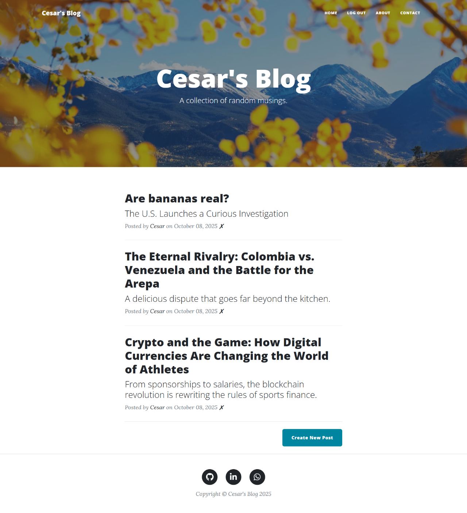
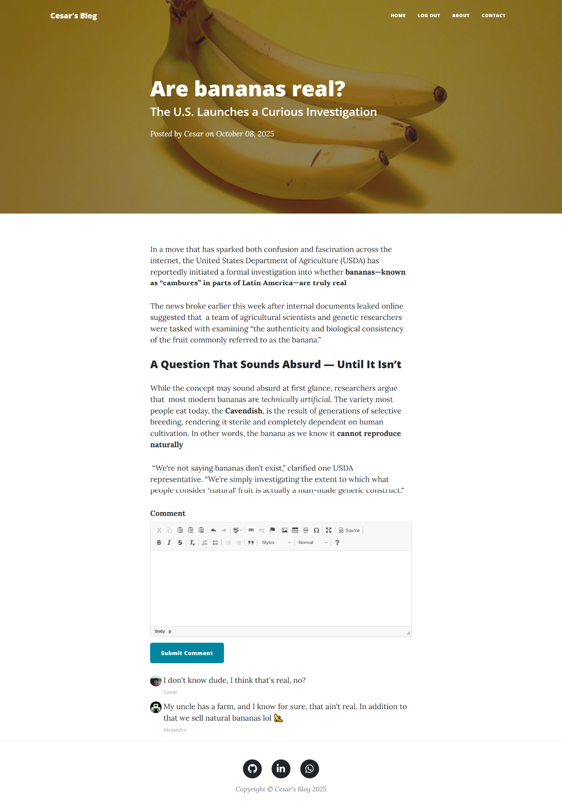
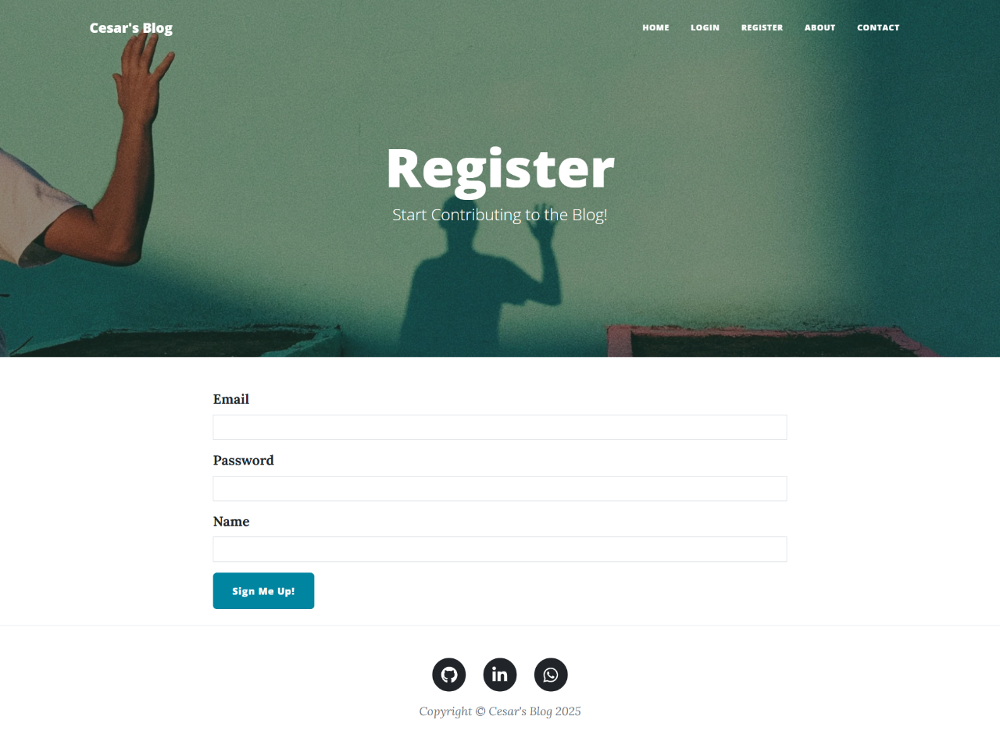
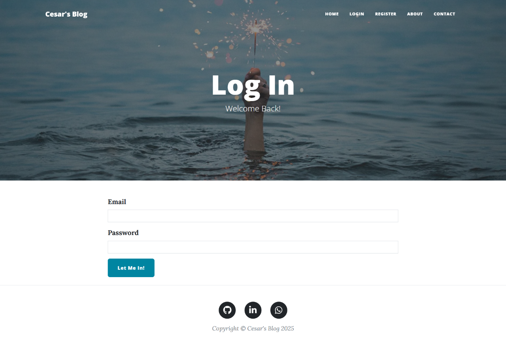
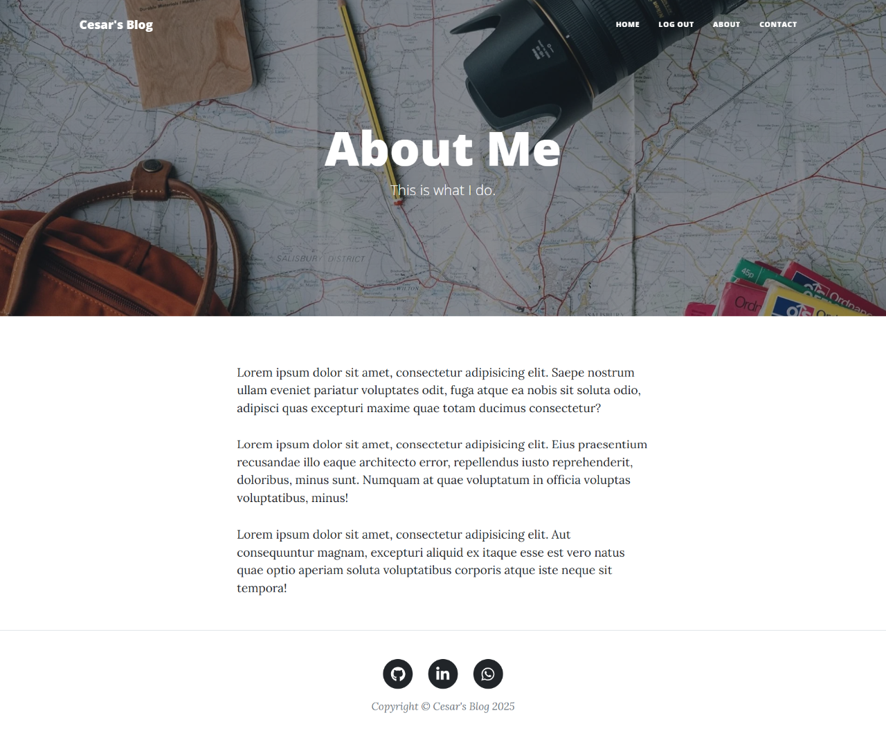
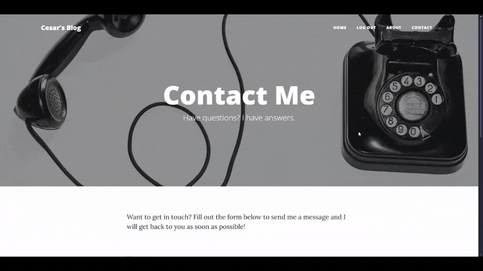

# 📝 Blog

A simple blogging platform built with Flask, SQLite, and Bootstrap 5.

---

## 🌍 Overview

Blog App is a functional blogging web application where users can register, log in, and create blog posts using a rich-text editor (CKEditor). Posts can be managed through editing and deleting, while visitors can leave comments on individual entries. It was designed to practice core web development concepts with Flask, covering authentication, CRUD operations, and responsive UI.

---

## ✨ Features

- 👤 User authentication (register/login/logout)
- 📝 Create, edit, and delete blog posts
- 💬 Comment system for posts
- 🖊️ Rich-text editor integration with CKEditor
- 🎨 Responsive UI with Bootstrap 5
- 💾 Lightweight database with SQLite

---

## 📸 Showcase

### 🏠 Homepage



### 📝 Post View



### ✏️ Create Post


### 💬 Comment Post


### 🔐 Register / Login




### 👤 About Me



### 📞 Contact



---

## 🛠️ Tech Stack

- **Backend:** Flask (Python)
- **Frontend:** Bootstrap 5, HTML5, CSS3, JavaScript
- **Database:** SQLite
- **Libraries:** Flask-WTF, Flask-Login, Flask-SQLAlchemy, Flask-CKEditor

---

## 📂 Project Structure

```text
Blog/
│── main.py
│── forms.py
│── requirements.txt
│
├── static/
│   ├── assets/
│   │   ├── img/
│   │   └── icons/favicon.ico
│   ├── css/
│   │   └── styles.css
│   └── js/
│       └── scripts.js
│
├── templates/
│   ├── about.html
│   ├── contact.html
│   ├── footer.html
│   ├── header.html
│   ├── index.html
│   ├── login.html
│   ├── make-post.html
│   ├── post.html
│   └── register.html
│
└── README.md
```

---

## ⚙️ Installation & Setup

### Clone repository

```bash
git clone https://github.com/fockus26/blog.git
cd BlogApp
```

### Create virtual environment

```bash
python -m venv venv
source venv/bin/activate   # macOS/Linux
venv\Scripts\activate      # Windows
```

### Install dependencies

```bash
pip install -r requirements.txt
```

### Run application

```bash
flask run
```

App will run at: http://localhost:5000

---

## 📖 Case Study

This project was developed as part of a Python learning path to strengthen backend and frontend integration with Flask. It emphasizes user authentication, CRUD operations for blog posts, and template rendering for dynamic UI. Although simple in scope, it represents a strong foundation for scalable blog applications.

---

## 📈 Future Improvements

- 🔐 Add password reset functionality
- 🖼️ Enable image uploads for blog posts
- 🗄️ Migrate to PostgreSQL or MySQL for scalability
- 📊 Create an admin panel for user/content management
- 🌍 Deploy to Heroku, Render, or other cloud hosting platforms
